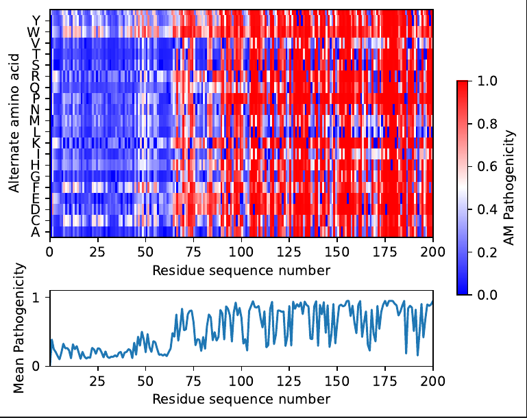
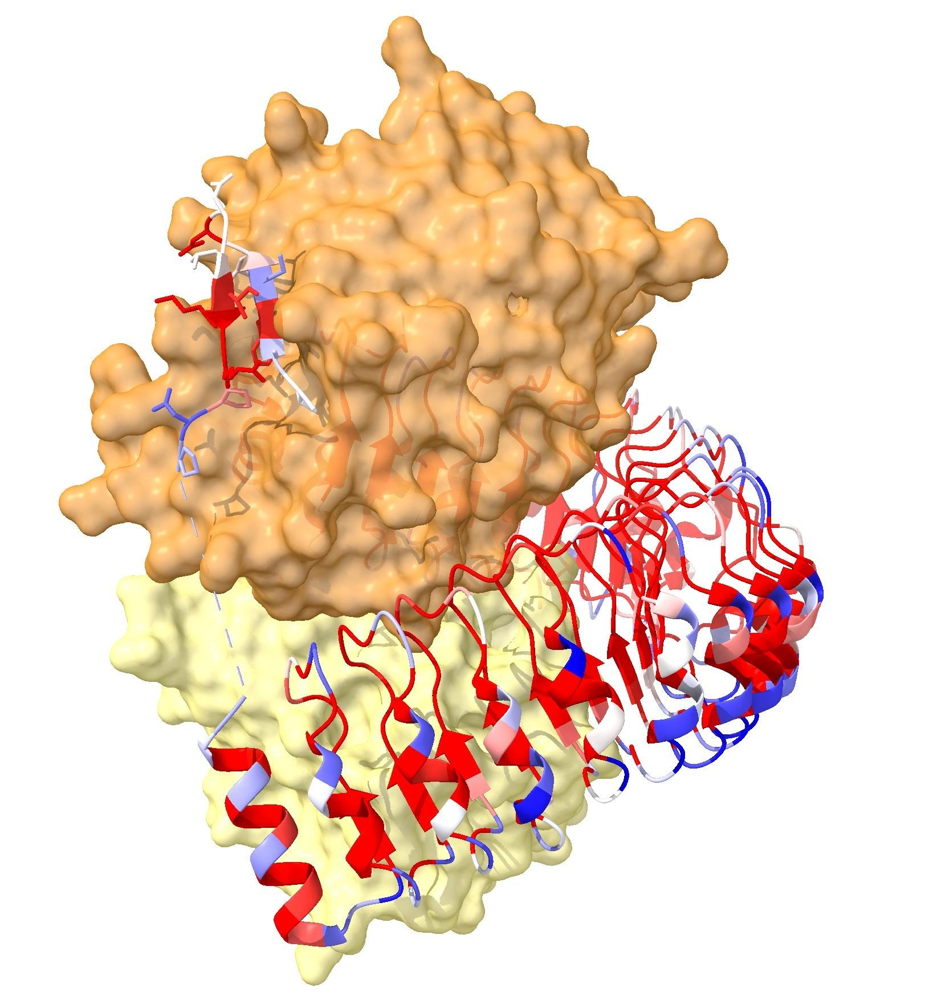

[](https://zenodo.org/badge/latestdoi/697276360)

# pymissense
PyMissense generates the pathogenicity plot and modified pdb as shown in the [AlphaMissense paper](https://www.science.org/doi/10.1126/science.adg7492) for custom proteins.

## What it does

AlphaMissense allows you to identify regions in your amino acid chain that are critical for protein function. This script does two things:

1. It generates a plot similar to [Figure 3D](https://www.science.org/doi/10.1126/science.adg7492#F3) of the [AlphaMissense paper](https://www.science.org/doi/10.1126/science.adg7492)

   


2. It generates a modified PDB file where the temperature factor (bfactor) is replaced by the pathogenicity predicted by AlphaMissense, allowing the effect to be visualised with Chimerax, as in [Figure 3E](https://www.science.org/doi/10.1126/science.adg7492#F3) of the paper:

   

## How to install

```
pip install pymissense
```
    
## How to use it

General usage is:
```
usage: pymissense[-h] [--tsv TSV] [--pdbpath PDBPATH] [--maxacid MAXACID] uniprot_id output_path

AlphaMissense plot and pdb generator

positional arguments:
  uniprot_id         UNIPROT ID
  output_path        Output folder

options:
  -h, --help         show this help message and exit
  --tsv TSV          You can provide the path to the tsv file if you want to skip the download. (default: None)
  --pdbpath PDBPATH  If defined, it will write the pathogenicity as bfactor in that PDB. If its not defined or not existing it will instead download the alphafold predicted PDB (default: None)
  --maxacid MAXACID  Maximum squence number to use in the plot. (default: None)
```

You can give the optional argument `--pdbpath` if you want to use an experimental PDB, otherwise it will download the alphafold predicted PDB instead. With `--tsv` you can provide the decompressed AlphaMissense database, so that pymissense does not need to download it.

For example, to reproduce [Figure 3D](https://www.science.org/doi/10.1126/science.adg7492#F3) (the middle one) and generate the PDB shown in [Figure 3E](https://www.science.org/doi/10.1126/science.adg7492#F3) do:

```
wget https://files.rcsb.org/download/7UPI.pdb
pymissense Q9UQ13 out --maxacid 200 --pdbpath 7upi.pdb 
```

Note that only the first 200 amino acids are shown in the plots and the pathogenicity is shown with the experimental PDB `7upi`.

## Contributions

This script was developed in collaboration with Tobias Raisch 
